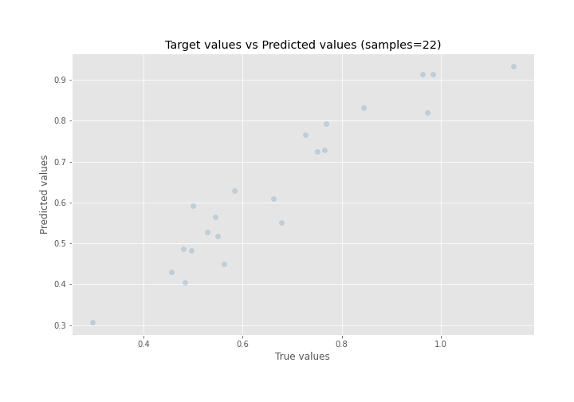

# Summary of Ensemble

[<< Go back](../README.md)

## Ensemble structure
| Model              |   Weight |
|:-------------------|---------:|
| 15_LightGBM        |        7 |
| 5_Default_LightGBM |        4 |

### Metric details:
| Metric   |      Score |
|:---------|-----------:|
| MAE      | 0.0563512  |
| MSE      | 0.00594938 |
| RMSE     | 0.0771323  |
| R2       | 0.861188   |
| MAPE     | 0.0803484  |

## Learning curves

## True vs Predicted

## Predicted vs Residuals

[<< Go back](../README.md)
