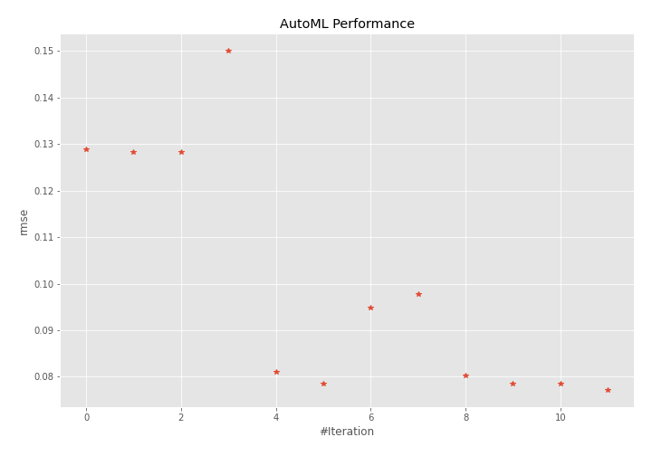
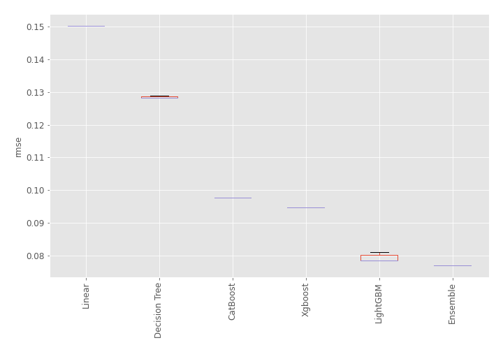
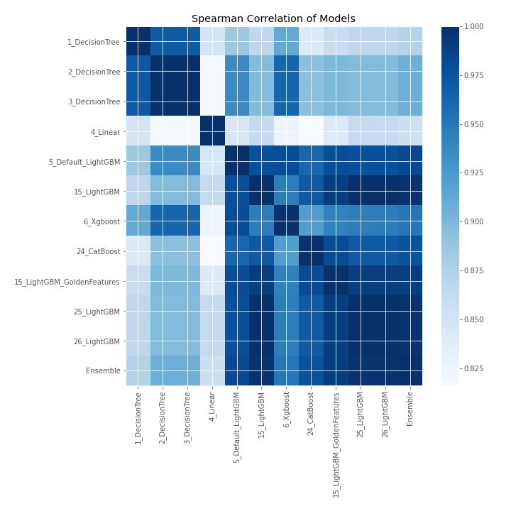

# AutoML Leaderboard

| Best model   | name                                                               | model_type    | metric_type   |   metric_value |   train_time |
|:-------------|:-------------------------------------------------------------------|:--------------|:--------------|---------------:|-------------:|
|              | [1_DecisionTree](1_DecisionTree/README.md)                         | Decision Tree | rmse          |      0.128953  |         0.35 |
|              | [2_DecisionTree](2_DecisionTree/README.md)                         | Decision Tree | rmse          |      0.128301  |         0.37 |
|              | [3_DecisionTree](3_DecisionTree/README.md)                         | Decision Tree | rmse          |      0.128301  |         0.4  |
|              | [4_Linear](4_Linear/README.md)                                     | Linear        | rmse          |      0.150131  |         0.42 |
|              | [5_Default_LightGBM](5_Default_LightGBM/README.md)                 | LightGBM      | rmse          |      0.0811345 |         0.53 |
|              | [15_LightGBM](15_LightGBM/README.md)                               | LightGBM      | rmse          |      0.0785008 |         0.58 |
|              | [6_Xgboost](6_Xgboost/README.md)                                   | Xgboost       | rmse          |      0.0948671 |         0.67 |
|              | [24_CatBoost](24_CatBoost/README.md)                               | CatBoost      | rmse          |      0.097749  |         1.47 |
|              | [15_LightGBM_GoldenFeatures](15_LightGBM_GoldenFeatures/README.md) | LightGBM      | rmse          |      0.0803474 |         2.11 |
|              | [25_LightGBM](25_LightGBM/README.md)                               | LightGBM      | rmse          |      0.0785008 |         0.64 |
|              | [26_LightGBM](26_LightGBM/README.md)                               | LightGBM      | rmse          |      0.0785008 |         0.68 |
| **the best** | [Ensemble](Ensemble/README.md)                                     | Ensemble      | rmse          |      0.0771323 |         0.3  |

### AutoML Performance

### AutoML Performance Boxplot

### Spearman Correlation of Models

