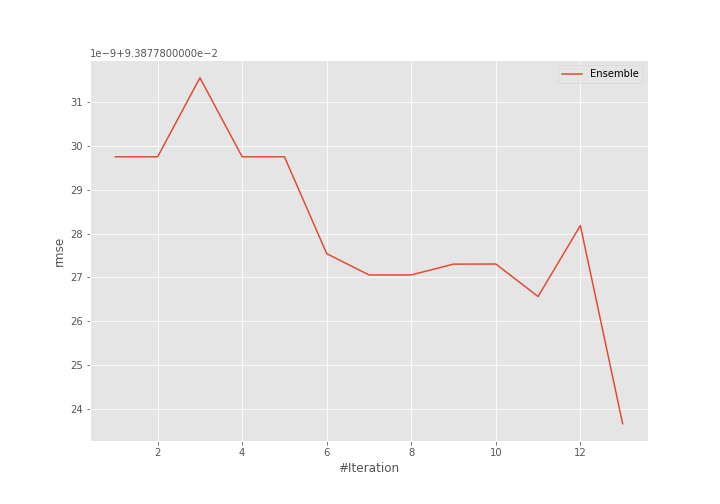
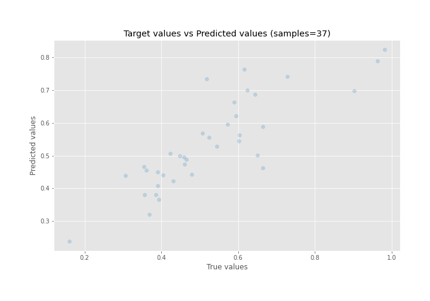
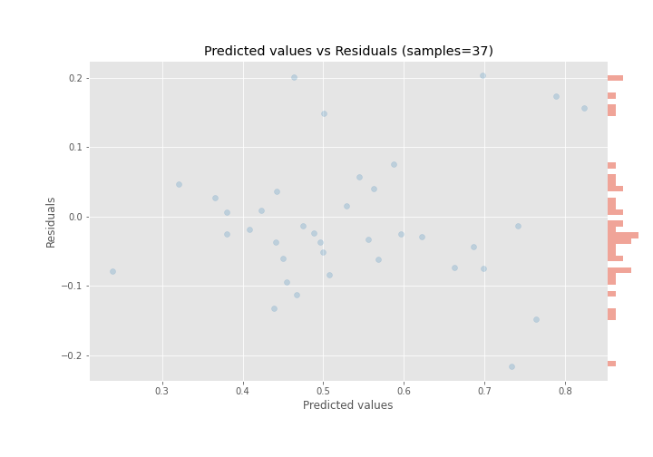

# Summary of Ensemble

[<< Go back](../README.md)

## Ensemble structure
| Model     |   Weight |
|:----------|---------:|
| 6_Xgboost |       13 |

### Metric details:
| Metric   |      Score |
|:---------|-----------:|
| MAE      | 0.0726321  |
| MSE      | 0.00881305 |
| RMSE     | 0.0938778  |
| R2       | 0.706242   |
| MAPE     | 0.143782   |

## Learning curves

## True vs Predicted

## Predicted vs Residuals

[<< Go back](../README.md)
