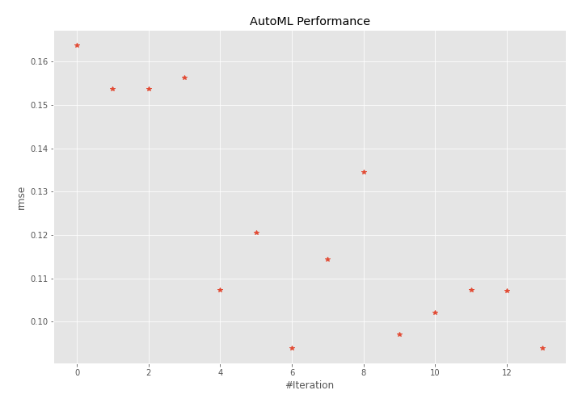

# AutoML Leaderboard

| Best model   | name                                               | model_type    | metric_type   |   metric_value |   train_time |
|:-------------|:---------------------------------------------------|:--------------|:--------------|---------------:|-------------:|
|              | [1_DecisionTree](1_DecisionTree/README.md)         | Decision Tree | rmse          |      0.163833  |         0.38 |
|              | [2_DecisionTree](2_DecisionTree/README.md)         | Decision Tree | rmse          |      0.153806  |         0.4  |
|              | [3_DecisionTree](3_DecisionTree/README.md)         | Decision Tree | rmse          |      0.153806  |         0.45 |
|              | [4_Linear](4_Linear/README.md)                     | Linear        | rmse          |      0.156293  |         0.43 |
|              | [5_Default_LightGBM](5_Default_LightGBM/README.md) | LightGBM      | rmse          |      0.107376  |         0.53 |
|              | [15_LightGBM](15_LightGBM/README.md)               | LightGBM      | rmse          |      0.12052   |         0.52 |
| **the best** | [6_Xgboost](6_Xgboost/README.md)                   | Xgboost       | rmse          |      0.0938778 |         0.64 |
|              | [24_CatBoost](24_CatBoost/README.md)               | CatBoost      | rmse          |      0.114398  |         1.05 |
|              | [33_RandomForest](33_RandomForest/README.md)       | Random Forest | rmse          |      0.134631  |         0.78 |
|              | [34_Xgboost](34_Xgboost/README.md)                 | Xgboost       | rmse          |      0.0970689 |         0.68 |
|              | [35_Xgboost](35_Xgboost/README.md)                 | Xgboost       | rmse          |      0.102107  |         0.6  |
|              | [36_LightGBM](36_LightGBM/README.md)               | LightGBM      | rmse          |      0.107376  |         0.7  |
|              | [37_Xgboost](37_Xgboost/README.md)                 | Xgboost       | rmse          |      0.107222  |         1.18 |
|              | [Ensemble](Ensemble/README.md)                     | Ensemble      | rmse          |      0.0938778 |         0.38 |

### AutoML Performance

### AutoML Performance Boxplot

### Spearman Correlation of Models

