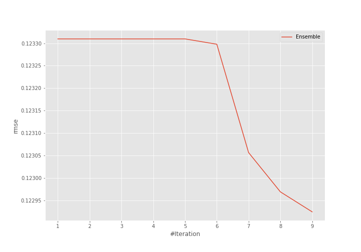
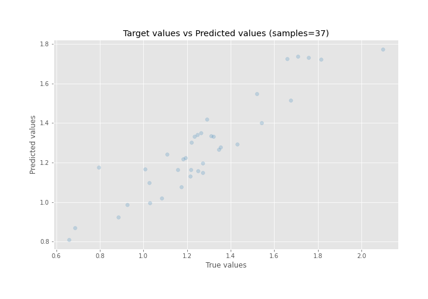
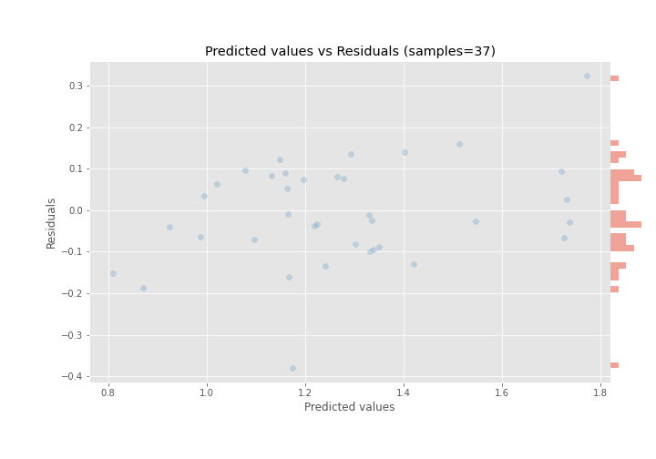

# Summary of Ensemble

[<< Go back](../README.md)

## Ensemble structure
| Model              |   Weight |
|:-------------------|---------:|
| 1_DecisionTree     |        1 |
| 5_Default_LightGBM |        7 |
| 6_Xgboost          |        1 |

### Metric details:
| Metric   |     Score |
|:---------|----------:|
| MAE      | 0.0964034 |
| MSE      | 0.0151103 |
| RMSE     | 0.122924  |
| R2       | 0.835972  |
| MAPE     | 0.0846575 |

## Learning curves

## True vs Predicted

## Predicted vs Residuals

[<< Go back](../README.md)
