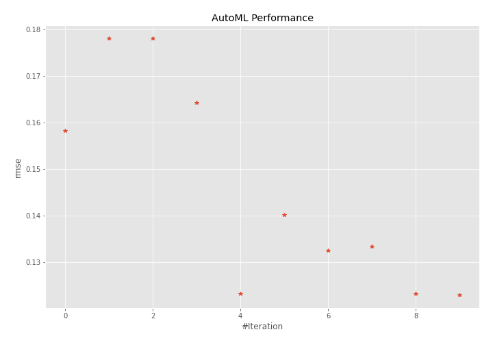
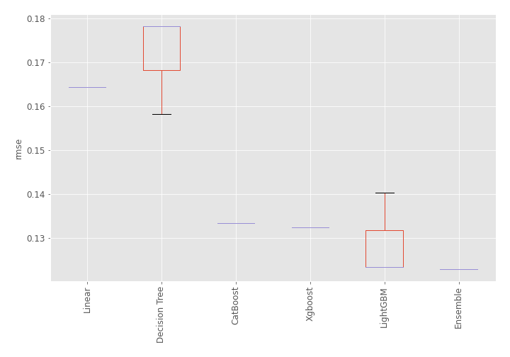
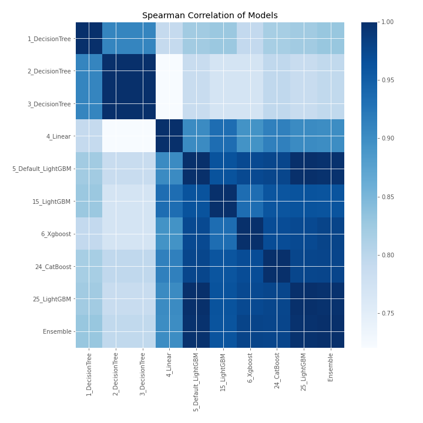

# AutoML Leaderboard

| Best model   | name                                               | model_type    | metric_type   |   metric_value |   train_time |
|:-------------|:---------------------------------------------------|:--------------|:--------------|---------------:|-------------:|
|              | [1_DecisionTree](1_DecisionTree/README.md)         | Decision Tree | rmse          |       0.158248 |         0.43 |
|              | [2_DecisionTree](2_DecisionTree/README.md)         | Decision Tree | rmse          |       0.178138 |         0.6  |
|              | [3_DecisionTree](3_DecisionTree/README.md)         | Decision Tree | rmse          |       0.178138 |         0.42 |
|              | [4_Linear](4_Linear/README.md)                     | Linear        | rmse          |       0.164228 |         0.48 |
|              | [5_Default_LightGBM](5_Default_LightGBM/README.md) | LightGBM      | rmse          |       0.12331  |         0.61 |
|              | [15_LightGBM](15_LightGBM/README.md)               | LightGBM      | rmse          |       0.140217 |         0.54 |
|              | [6_Xgboost](6_Xgboost/README.md)                   | Xgboost       | rmse          |       0.132467 |         1.61 |
|              | [24_CatBoost](24_CatBoost/README.md)               | CatBoost      | rmse          |       0.133409 |         1.02 |
|              | [25_LightGBM](25_LightGBM/README.md)               | LightGBM      | rmse          |       0.12331  |         3.22 |
| **the best** | [Ensemble](Ensemble/README.md)                     | Ensemble      | rmse          |       0.122924 |         0.3  |

### AutoML Performance

### AutoML Performance Boxplot

### Spearman Correlation of Models

