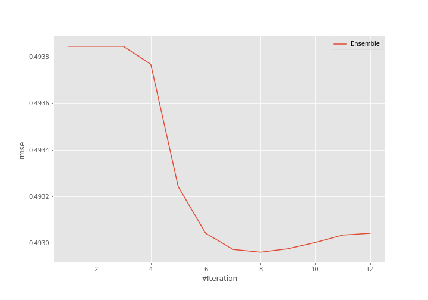
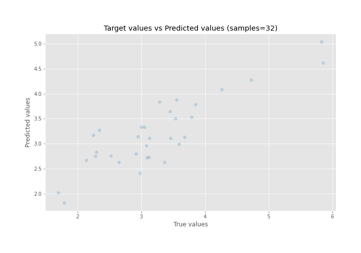
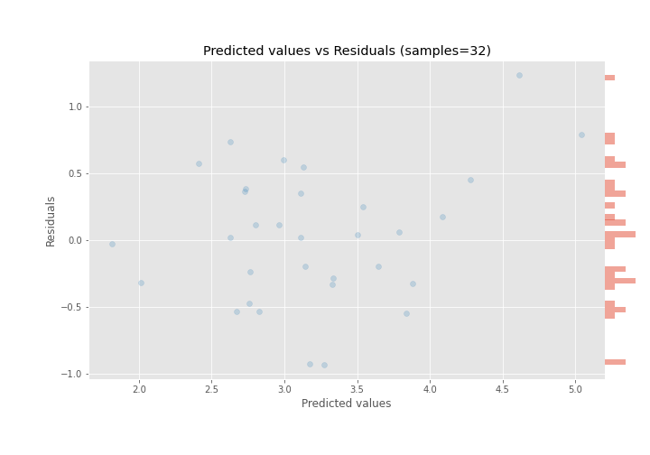

# Summary of Ensemble

[<< Go back](../README.md)

## Ensemble structure
| Model              |   Weight |
|:-------------------|---------:|
| 36_LightGBM        |        7 |
| 5_Default_LightGBM |        1 |

### Metric details:
| Metric   |    Score |
|:---------|---------:|
| MAE      | 0.396932 |
| MSE      | 0.24301  |
| RMSE     | 0.49296  |
| R2       | 0.728701 |
| MAPE     | 0.12876  |

## Learning curves

## True vs Predicted

## Predicted vs Residuals

[<< Go back](../README.md)
