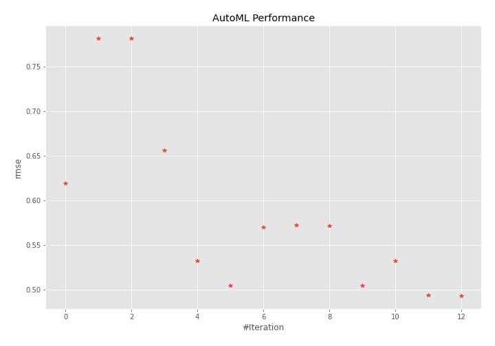
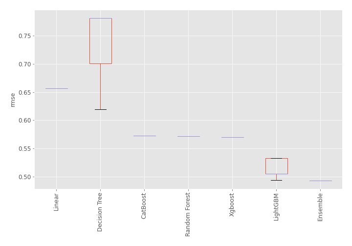
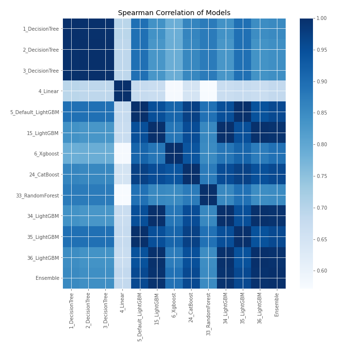

# AutoML Leaderboard

| Best model   | name                                               | model_type    | metric_type   |   metric_value |   train_time |
|:-------------|:---------------------------------------------------|:--------------|:--------------|---------------:|-------------:|
|              | [1_DecisionTree](1_DecisionTree/README.md)         | Decision Tree | rmse          |       0.619586 |         0.43 |
|              | [2_DecisionTree](2_DecisionTree/README.md)         | Decision Tree | rmse          |       0.781823 |         0.42 |
|              | [3_DecisionTree](3_DecisionTree/README.md)         | Decision Tree | rmse          |       0.781823 |         0.51 |
|              | [4_Linear](4_Linear/README.md)                     | Linear        | rmse          |       0.656367 |         0.48 |
|              | [5_Default_LightGBM](5_Default_LightGBM/README.md) | LightGBM      | rmse          |       0.532562 |         0.6  |
|              | [15_LightGBM](15_LightGBM/README.md)               | LightGBM      | rmse          |       0.504828 |         0.52 |
|              | [6_Xgboost](6_Xgboost/README.md)                   | Xgboost       | rmse          |       0.56994  |         0.58 |
|              | [24_CatBoost](24_CatBoost/README.md)               | CatBoost      | rmse          |       0.572655 |         0.82 |
|              | [33_RandomForest](33_RandomForest/README.md)       | Random Forest | rmse          |       0.571727 |         0.73 |
|              | [34_LightGBM](34_LightGBM/README.md)               | LightGBM      | rmse          |       0.504828 |         0.59 |
|              | [35_LightGBM](35_LightGBM/README.md)               | LightGBM      | rmse          |       0.532562 |         0.68 |
|              | [36_LightGBM](36_LightGBM/README.md)               | LightGBM      | rmse          |       0.493845 |         0.61 |
| **the best** | [Ensemble](Ensemble/README.md)                     | Ensemble      | rmse          |       0.49296  |         0.35 |

### AutoML Performance

### AutoML Performance Boxplot

### Spearman Correlation of Models

