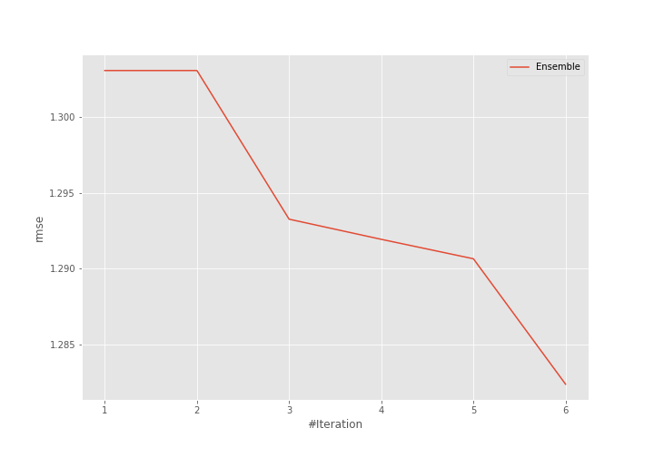
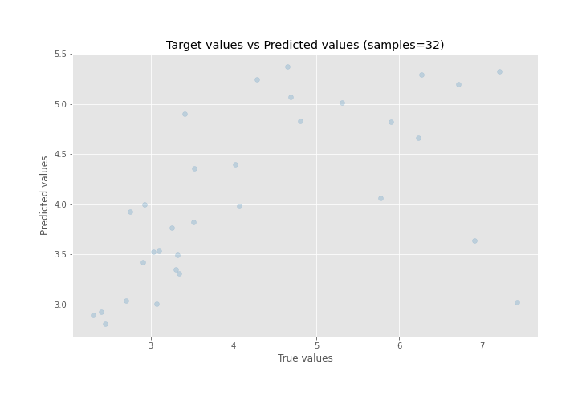
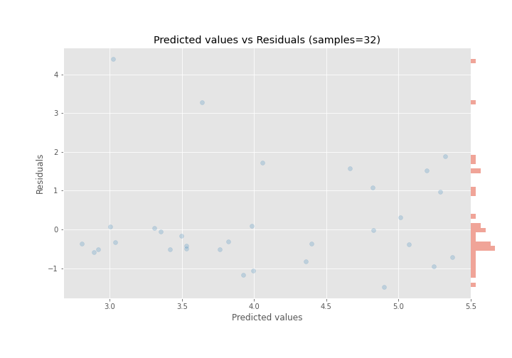

# Summary of Ensemble

[<< Go back](../README.md)

## Ensemble structure
| Model          |   Weight |
|:---------------|---------:|
| 1_DecisionTree |        1 |
| 2_DecisionTree |        1 |
| 4_Linear       |        1 |
| 5_Xgboost      |        3 |

### Metric details:
| Metric   |    Score |
|:---------|---------:|
| MAE      | 0.880153 |
| MSE      | 1.64454  |
| RMSE     | 1.2824   |
| R2       | 0.298355 |
| MAPE     | 0.190151 |

## Learning curves

## True vs Predicted

## Predicted vs Residuals

[<< Go back](../README.md)
