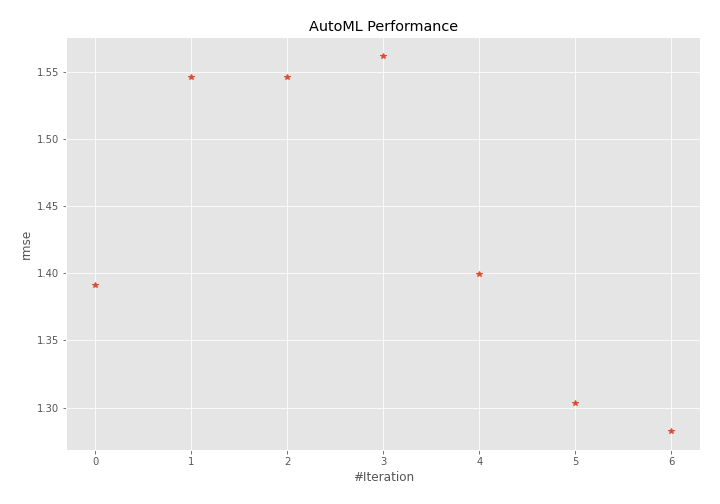
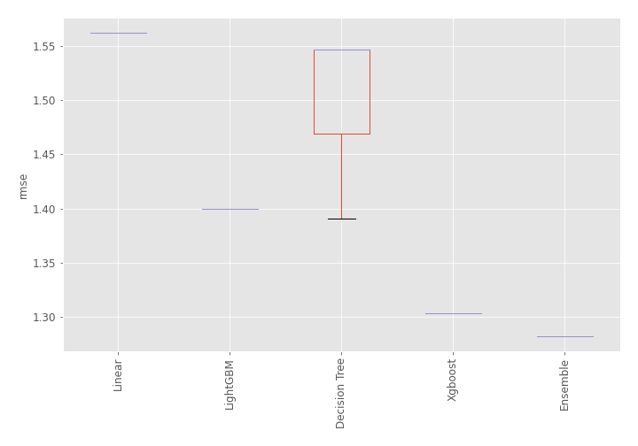
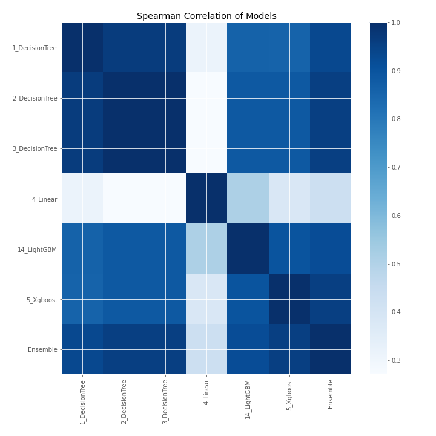

# AutoML Leaderboard

| Best model   | name                                       | model_type    | metric_type   |   metric_value |   train_time |
|:-------------|:-------------------------------------------|:--------------|:--------------|---------------:|-------------:|
|              | [1_DecisionTree](1_DecisionTree/README.md) | Decision Tree | rmse          |        1.39089 |         0.7  |
|              | [2_DecisionTree](2_DecisionTree/README.md) | Decision Tree | rmse          |        1.54633 |         0.72 |
|              | [3_DecisionTree](3_DecisionTree/README.md) | Decision Tree | rmse          |        1.54633 |         0.6  |
|              | [4_Linear](4_Linear/README.md)             | Linear        | rmse          |        1.56181 |         0.7  |
|              | [14_LightGBM](14_LightGBM/README.md)       | LightGBM      | rmse          |        1.39937 |         1.86 |
|              | [5_Xgboost](5_Xgboost/README.md)           | Xgboost       | rmse          |        1.30304 |        23.03 |
| **the best** | [Ensemble](Ensemble/README.md)             | Ensemble      | rmse          |        1.2824  |         0.21 |

### AutoML Performance

### AutoML Performance Boxplot

### Spearman Correlation of Models

