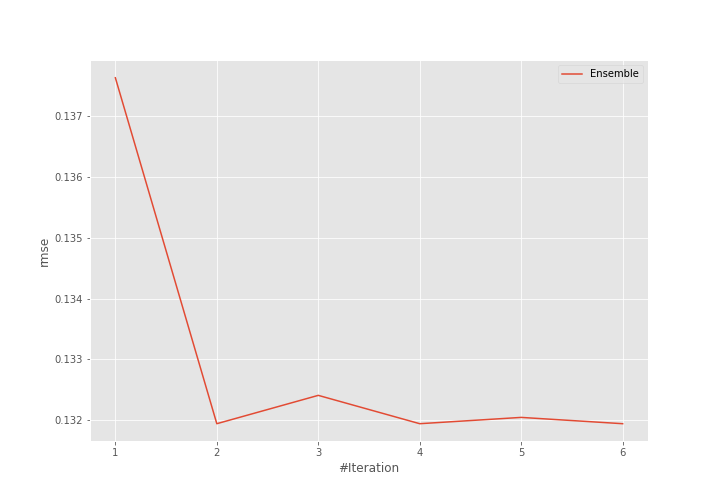
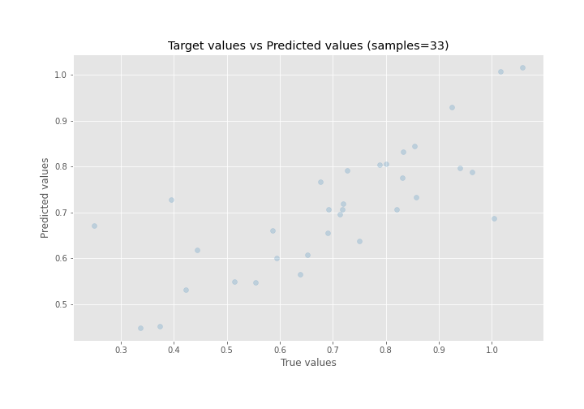
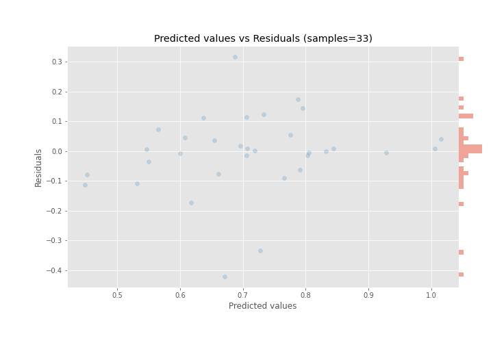

# Summary of Ensemble

[<< Go back](../README.md)

## Ensemble structure
| Model       |   Weight |
|:------------|---------:|
| 14_LightGBM |        1 |
| 5_Xgboost   |        1 |

### Metric details:
| Metric   |     Score |
|:---------|----------:|
| MAE      | 0.0855895 |
| MSE      | 0.0174086 |
| RMSE     | 0.131942  |
| R2       | 0.583523  |
| MAPE     | 0.172342  |

## Learning curves

## True vs Predicted

## Predicted vs Residuals

[<< Go back](../README.md)
