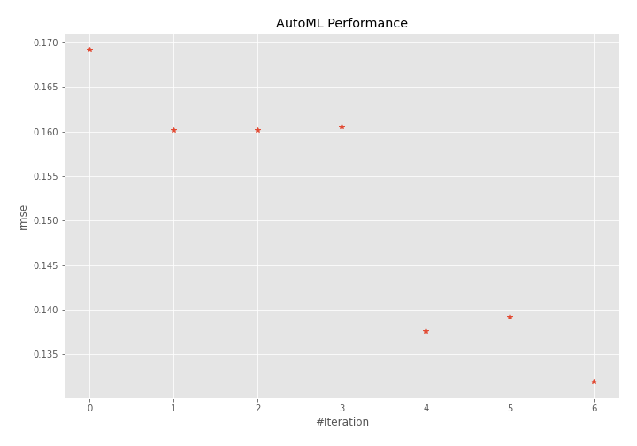
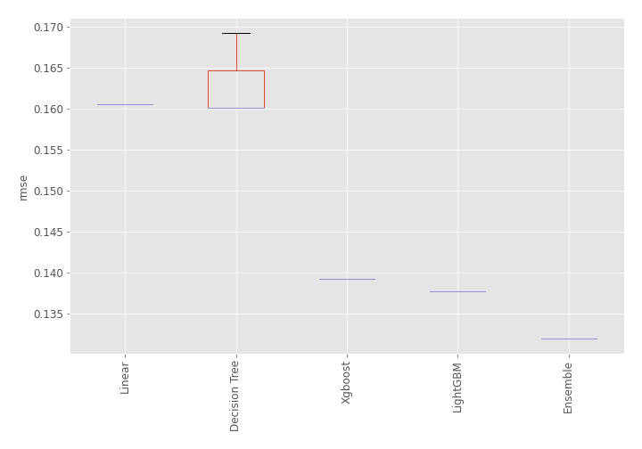
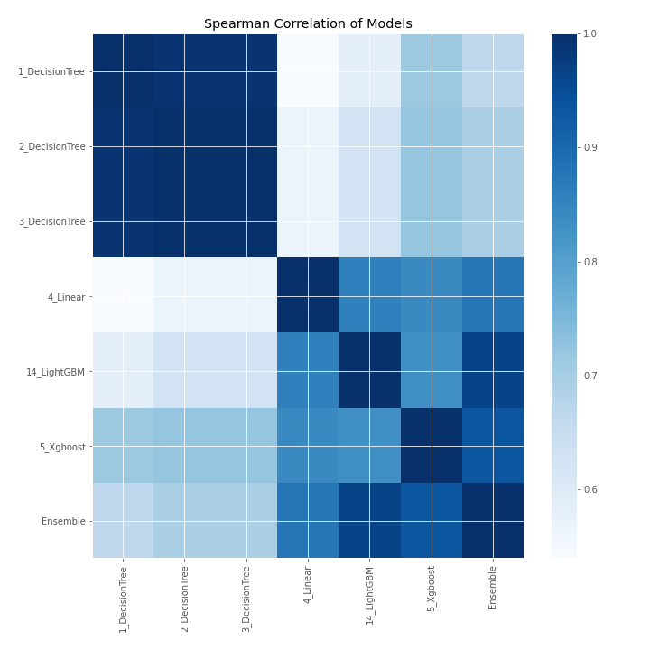

# AutoML Leaderboard

| Best model   | name                                       | model_type    | metric_type   |   metric_value |   train_time |
|:-------------|:-------------------------------------------|:--------------|:--------------|---------------:|-------------:|
|              | [1_DecisionTree](1_DecisionTree/README.md) | Decision Tree | rmse          |       0.169203 |         0.58 |
|              | [2_DecisionTree](2_DecisionTree/README.md) | Decision Tree | rmse          |       0.160112 |         0.58 |
|              | [3_DecisionTree](3_DecisionTree/README.md) | Decision Tree | rmse          |       0.160112 |         0.55 |
|              | [4_Linear](4_Linear/README.md)             | Linear        | rmse          |       0.160514 |         0.54 |
|              | [14_LightGBM](14_LightGBM/README.md)       | LightGBM      | rmse          |       0.137631 |         0.71 |
|              | [5_Xgboost](5_Xgboost/README.md)           | Xgboost       | rmse          |       0.139166 |         6.37 |
| **the best** | [Ensemble](Ensemble/README.md)             | Ensemble      | rmse          |       0.131942 |         0.32 |

### AutoML Performance

### AutoML Performance Boxplot

### Spearman Correlation of Models

